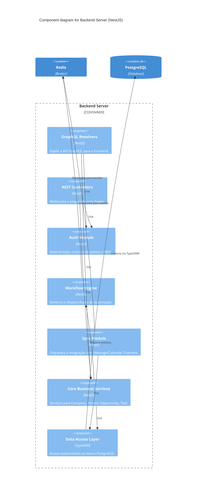

# C4 - Diagrama de Componentes (Backend Server)

```mermaid
C4Component
  title Component diagram for Backend Server (NestJS)

  Container_Boundary(backend, "Backend Server") {
    Component(graphql_api, "GraphQL Resolvers", "NestJS", "Expõe a API GraphQL para o Frontend.")
    Component(rest_api, "REST Controllers", "NestJS", "Webhooks e integração com Zapier.")
    
    Component(auth_module, "Auth Module", "NestJS", "Autenticação, controle de acesso e RBAC.")
    Component(workflow_module, "Workflow Engine", "NestJS", "Gerencia e dispara fluxos de automação.")
    Component(sync_module, "Sync Module", "NestJS", "Orquestra a integração com Message/Calendar Channels.")
    
    Component(core_services, "Core Business Services", "NestJS", "Serviços para Company, Person, Opportunity, Task.")
    Component(data_access, "Data Access Layer", "TypeORM", "Acesso padronizado ao banco PostgreSQL.")
  }

  Container(redis, "Redis", "Broker")
  ContainerDb(pg, "PostgreSQL", "Database")

  Rel(graphql_api, auth_module, "Usa")
  Rel(graphql_api, core_services, "Usa")
  Rel(rest_api, auth_module, "Usa")
  Rel(rest_api, core_services, "Usa")
  
  Rel(core_services, data_access, "Usa")
  Rel(core_services, workflow_module, "Dispara eventos")
  Rel(sync_module, data_access, "Usa")
  
  Rel(workflow_module, redis, "Envia jobs para worker")
  Rel(sync_module, redis, "Envia jobs para worker")
  Rel(data_access, pg, "Conecta via TypeORM")
```
> Confiança: 🟡 INFERIDO (Baseado nas dependências e domínios mapeados)
