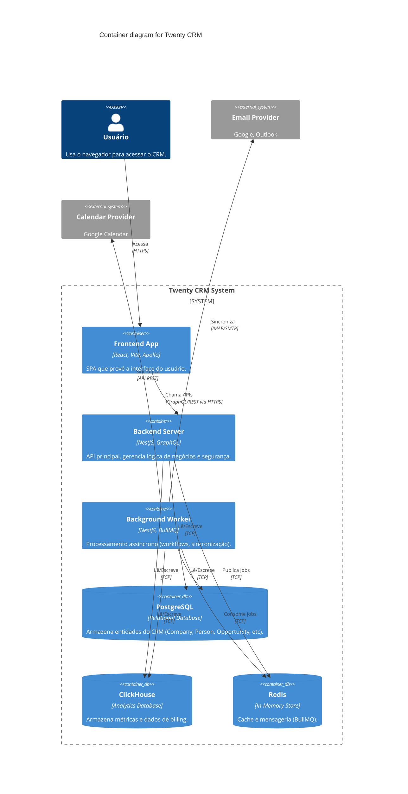

# C4 - Diagrama de Containers

```mermaid
C4Container
  title Container diagram for Twenty CRM

  Person(user, "Usuário", "Usa o navegador para acessar o CRM.")

  System_Boundary(twenty_crm, "Twenty CRM System") {
    Container(web_app, "Frontend App", "React, Vite, Apollo", "SPA que provê a interface do usuário.")
    Container(api_gateway, "Backend Server", "NestJS, GraphQL", "API principal, gerencia lógica de negócios e segurança.")
    Container(worker, "Background Worker", "NestJS, BullMQ", "Processamento assíncrono (workflows, sincronização).")
    
    ContainerDb(db_pg, "PostgreSQL", "Relational Database", "Armazena entidades do CRM (Company, Person, Opportunity, etc).")
    ContainerDb(db_clickhouse, "ClickHouse", "Analytics Database", "Armazena métricas e dados de billing.")
    ContainerDb(redis, "Redis", "In-Memory Store", "Cache e mensageria (BullMQ).")
  }

  System_Ext(email, "Email Provider", "Google, Outlook")
  System_Ext(calendar, "Calendar Provider", "Google Calendar")

  Rel(user, web_app, "Acessa", "HTTPS")
  Rel(web_app, api_gateway, "Chama APIs", "GraphQL/REST via HTTPS")
  
  Rel(api_gateway, db_pg, "Lê/Escreve", "TCP")
  Rel(api_gateway, db_clickhouse, "Lê/Escreve", "TCP")
  Rel(api_gateway, redis, "Publica jobs", "TCP")
  
  Rel(worker, redis, "Consome jobs", "TCP")
  Rel(worker, db_pg, "Lê/Escreve", "TCP")
  Rel(worker, db_clickhouse, "Lê/Escreve", "TCP")
  
  Rel(worker, email, "Sincroniza", "IMAP/SMTP")
  Rel(worker, calendar, "Sincroniza", "API REST")
```
> Confiança: 🟢 CONFIRMADO
