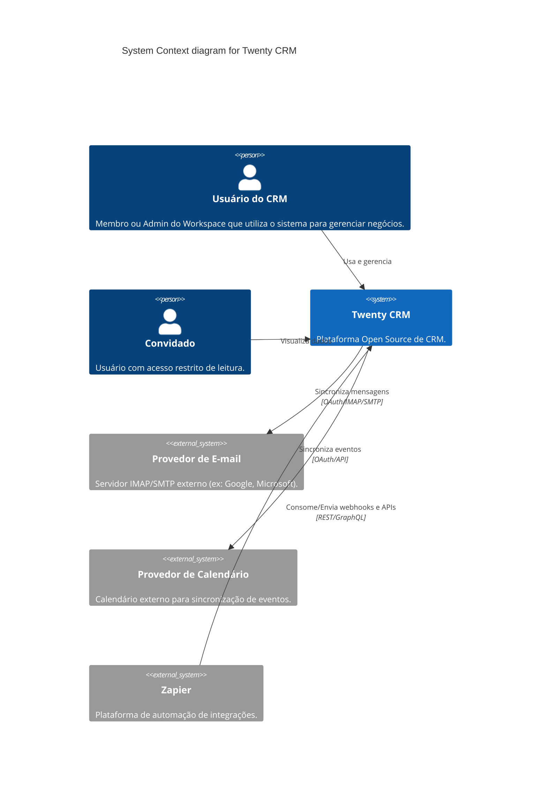

# C4 - Diagrama de Contexto

```mermaid
C4Context
  title System Context diagram for Twenty CRM
  
  Person(user, "Usuário do CRM", "Membro ou Admin do Workspace que utiliza o sistema para gerenciar negócios.")
  Person(guest, "Convidado", "Usuário com acesso restrito de leitura.")
  
  System(twenty, "Twenty CRM", "Plataforma Open Source de CRM.")
  
  System_Ext(email_provider, "Provedor de E-mail", "Servidor IMAP/SMTP externo (ex: Google, Microsoft).")
  System_Ext(calendar_provider, "Provedor de Calendário", "Calendário externo para sincronização de eventos.")
  System_Ext(zapier, "Zapier", "Plataforma de automação de integrações.")
  
  Rel(user, twenty, "Usa e gerencia")
  Rel(guest, twenty, "Visualiza dados")
  
  Rel(twenty, email_provider, "Sincroniza mensagens", "OAuth/IMAP/SMTP")
  Rel(twenty, calendar_provider, "Sincroniza eventos", "OAuth/API")
  Rel(zapier, twenty, "Consome/Envia webhooks e APIs", "REST/GraphQL")
```
> Confiança: 🟢 CONFIRMADO
