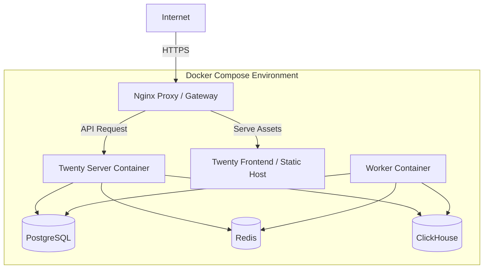

# Infraestrutura e Deployment

## Ambiente de Containerização
O sistema suporta deploy via Docker, como evidenciado pela presença do repositório/pasta de configurações Docker.

## Considerações
- O `packages/twenty-docker/docker-compose.yml` orquestra a dependência entre os serviços.
- Variáveis de ambiente secretas (OAuth, Database URLs, chaves de API) devem ser fornecidas ao `twenty-server` e workers.
- Bancos de dados persistem estado em volumes dedicados.
> Confiança: 🟢 CONFIRMADO
