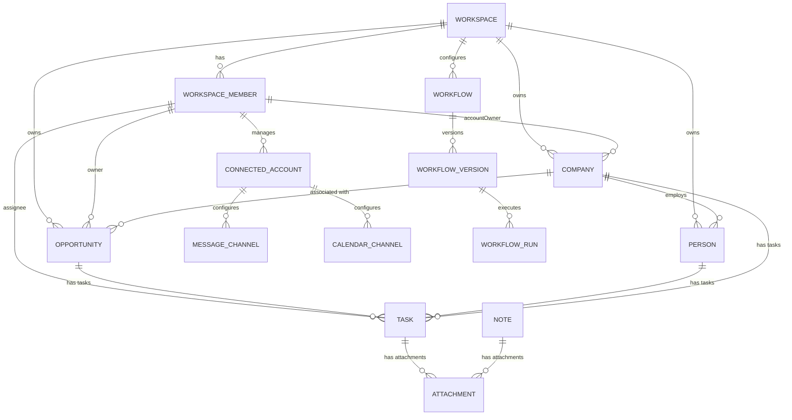

# Diagrama Entidade-Relacionamento (ERD)

```mermaid
erDiagram
    WORKSPACE ||--o{ WORKSPACE_MEMBER : has
    WORKSPACE ||--o{ COMPANY : owns
    WORKSPACE ||--o{ PERSON : owns
    WORKSPACE ||--o{ OPPORTUNITY : owns

    WORKSPACE_MEMBER ||--o{ COMPANY : "accountOwner"
    WORKSPACE_MEMBER ||--o{ OPPORTUNITY : "owner"
    WORKSPACE_MEMBER ||--o{ TASK : "assignee"
    WORKSPACE_MEMBER ||--o{ CONNECTED_ACCOUNT : manages

    COMPANY ||--o{ PERSON : employs
    COMPANY ||--o{ OPPORTUNITY : "associated with"
    
    OPPORTUNITY ||--o{ TASK : "has tasks"
    PERSON ||--o{ TASK : "has tasks"
    COMPANY ||--o{ TASK : "has tasks"
    
    TASK ||--o{ ATTACHMENT : "has attachments"
    NOTE ||--o{ ATTACHMENT : "has attachments"

    CONNECTED_ACCOUNT ||--o{ MESSAGE_CHANNEL : configures
    CONNECTED_ACCOUNT ||--o{ CALENDAR_CHANNEL : configures

    WORKSPACE ||--o{ WORKFLOW : configures
    WORKFLOW ||--o{ WORKFLOW_VERSION : versions
    WORKFLOW_VERSION ||--o{ WORKFLOW_RUN : executes
```
> Confiança: 🟢 CONFIRMADO (As relações genéricas polimórficas foram simplificadas para melhor visualização)
