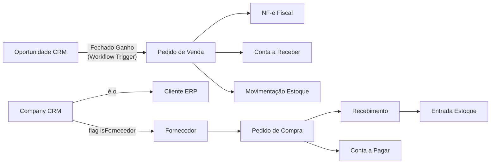

# IDEIA-ERP-CRM-01 — Twenty como Núcleo de um ERP+CRM Modular

> **Status:** 💡 Ideia — Para revisão e decisão
> **Autor:** Antigravity (gerado a partir da análise Reversa)
> **Data:** 2026-05-11
> **Categoria:** Evolução de Produto — Transformação Estratégica

---

## 1. A Tese Central

> **"O CRM já é o coração de qualquer negócio. O ERP é o corpo."**

O Twenty CRM possui uma base técnica extraordinariamente sólida: modelo de objetos flexível (Standard Objects + Custom Objects), motor de automação (Workflow), multi-tenancy por Workspace, GraphQL API completa, sistema de permissões, busca vetorial, dashboards dinâmicos e uma UI premium.

**A tese é simples:** tudo que um ERP precisa para funcionar — entidades, relacionamentos, permissões, automações, auditoria, relatórios — o Twenty já entrega como infraestrutura. O que falta são os **módulos de domínio ERP** construídos em cima dessa base.

Ao invés de construir um ERP do zero ou comprar um sistema legado, transformamos o Twenty em um produto novo:

```
twenty-crm-erp (NOVA IDENTIDADE)
├── CRM Layer (já existe — preservado)  ← serves the ERP
│   ├── Empresas / Pessoas / Oportunidades
│   ├── Workflow Engine
│   ├── Timeline & Auditoria
│   └── Connected Accounts
└── ERP Layer (novo — modular)
    ├── Módulo: Pedidos & Orçamentos
    ├── Módulo: Financeiro
    ├── Módulo: Estoque & Produtos
    ├── Módulo: Compras & Fornecedores
    ├── Módulo: Fiscal (NF-e / NFS-e)
    └── Módulo: Relatórios Gerenciais
```

---

## 2. Por Que o Twenty é a Fundação Perfeita?

### 2.1 Ativos Técnicos Aproveitáveis (confirmados pelo Reversa)

| Ativo | Como o ERP reutiliza |
|-------|----------------------|
| **Standard Objects + BaseWorkspaceEntity** | Cada módulo ERP define seus próprios objetos (Pedido, Produto, Fatura) seguindo o mesmo padrão. Herda `id`, `createdAt`, `updatedAt`, `deletedAt`, `searchVector` automaticamente. |
| **Motor de Workflow (BullMQ + Trigger/Steps)** | Automatiza regras ERP: aprovação de compra, geração de NF-e ao fechar pedido, alertas de estoque mínimo, emissão de cobrança no vencimento. |
| **Sistema de Permissões (WorkspaceMember + Roles)** | Controla quem pode aprovar pedido, emitir nota fiscal, visualizar DRE. |
| **Timeline / Auditoria Polimórfica** | Todo evento ERP (mudança de status de pedido, lançamento financeiro, entrada de estoque) é rastreado automaticamente no feed da entidade pai. |
| **Dashboard Engine (PageLayout + Widget + ChartData)** | KPIs financeiros, gráficos de vendas por período, curva ABC de produtos — sem criar nova infraestrutura de BI. |
| **Busca Full-Text (TSVECTOR)** | Busca por número de pedido, nome de produto, fornecedor, número de NF-e. |
| **Attachments Polimórficos** | Anexar XML de NF-e, DANFE, contrato de fornecedor, boleto ao registro ERP correspondente. |
| **GraphQL API (NestJS)** | Todos os módulos ERP são consumidos pelo mesmo cliente React/Apollo. Integrações externas (marketplace, bancos) conectam pela mesma API. |
| **Multi-Workspace (Tenancy)** | Suporte natural a multi-empresa / multi-CNPJ sem nova arquitetura. |
| **Soft-Delete Global** | Cancelamentos de pedido, reversão de lançamentos financeiros — nunca destrutivos. |

### 2.2 O que o Twenty Já Resolve (Grátis)

- ✅ Autenticação e autorização de usuários
- ✅ Onboarding de workspace
- ✅ Estrutura de banco de dados modular (extensível por objetos)
- ✅ UI premium e responsiva (React + Linaria)
- ✅ Sistema de notificações e integrações (email, calendar, webhooks via Workflow)
- ✅ Infraestrutura de filas (BullMQ) para jobs assíncronos
- ✅ Analytics database (ClickHouse) — já disponível para relatórios pesados
- ✅ Storage de arquivos (local/S3/Backblaze) — pronto para XML NF-e, PDFs

---

## 3. A Lógica de Negócio: CRM Serve ao ERP

Em qualquer empresa real, o fluxo comercial-operacional é:

```
[PROSPECÇÃO]          [NEGOCIAÇÃO]         [CONVERSÃO]          [OPERAÇÃO ERP]
 Empresa/Pessoa   →   Oportunidade    →    FECHADO GANHO    →   Pedido de Venda
   (CRM)                (CRM)              (trigger)            (ERP)
                                                                     ↓
                                                             Separação de Estoque
                                                                     ↓
                                                             Emissão NF-e / Fatura
                                                                     ↓
                                                             Contas a Receber
                                                                     ↓
                                                             Baixa Financeira
```

O CRM existente cuida de **Empresa**, **Pessoa** e **Oportunidade**. O ponto de transição é o evento **"Fechado Ganho"** — que hoje no Twenty não faz nada além de mudar o estágio. Com o ERP integrado, esse evento dispara o motor de Workflow que cria automaticamente um **Pedido de Venda** no módulo ERP, puxando os dados da oportunidade (cliente, produtos, valor, contato).

**A Empresa e a Pessoa nunca são duplicadas.** O registro de CRM IS o registro de cliente no ERP. Um campo `erpCustomerCode` na Empresa é tudo que une os dois mundos.

---

## 4. Arquitetura Proposta — Módulos ERP como Standard Objects

### 4.1 Princípio de Design

Cada módulo ERP segue exatamente o mesmo padrão do Twenty:

```typescript
// Exemplo: PedidoWorkspaceEntity
@WorkspaceObject({
  standardId: PEDIDO_STANDARD_OBJECT_IDS.pedido,
  namePlural: 'pedidos',
  labelSingular: 'Pedido',
  labelPlural: 'Pedidos',
  description: 'Pedido de venda originado de uma Oportunidade',
  icon: 'IconShoppingCart',
})
export class PedidoWorkspaceEntity extends BaseWorkspaceEntity {
  @WorkspaceField({ type: FieldMetadataType.NUMBER, label: 'Número' })
  numero: number;

  @WorkspaceField({ type: FieldMetadataType.SELECT, label: 'Status' })
  status: PedidoStatusEnum; // RASCUNHO | APROVADO | FATURADO | CANCELADO

  @WorkspaceRelation({ ... })
  empresa: CompanyWorkspaceEntity; // ← reusa o CRM

  @WorkspaceRelation({ ... })
  oportunidade: OpportunityWorkspaceEntity; // ← rastreabilidade total

  @WorkspaceRelation({ ... })
  itens: PedidoItemWorkspaceEntity[];
  // ...
}
```

Este padrão garante:
- Integração nativa com Timeline (auditoria grátis)
- Busca full-text automática
- Soft-delete automático
- Disponibilidade na API GraphQL imediatamente

### 4.2 Mapa de Módulos ERP — Fase V1

```
ERP Layer
│
├── 📦 Catálogo
│   ├── Produto (SKU, descrição, preço, unidade, NCM/CEST)
│   ├── Categoria de Produto
│   └── Lista de Preços (por cliente, por volume)
│
├── 🛒 Pedidos & Orçamentos
│   ├── Pedido de Venda (← criado da Oportunidade CRM)
│   ├── Item de Pedido (← linha de produto)
│   ├── Orçamento (versão anterior ao pedido)
│   └── Aprovação de Pedido (via Workflow)
│
├── 📊 Estoque
│   ├── Movimentação de Estoque (entrada/saída/ajuste)
│   ├── Localização (depósito, prateleira)
│   └── Alerta de Estoque Mínimo (via Workflow Cron)
│
├── 🧾 Fiscal
│   ├── NF-e de Saída (venda)
│   ├── NFS-e (serviço)
│   ├── XML e DANFE (attachment polimórfico)
│   └── Integração SEFAZ (via serviço externo: Nuvem Fiscal, Focus NF-e)
│
├── 💰 Financeiro
│   ├── Conta a Receber (gerada do Pedido)
│   ├── Conta a Pagar (gerada do Pedido de Compra)
│   ├── Lançamento (baixa manual/automática)
│   ├── Centro de Custo
│   └── Fluxo de Caixa (dashboard ClickHouse)
│
├── 🏭 Compras
│   ├── Fornecedor (← extensão de Company CRM com flag `isFornecedor`)
│   ├── Requisição de Compra
│   ├── Pedido de Compra
│   └── Recebimento de Mercadoria (→ gera Movimentação de Estoque)
│
└── 📈 Relatórios Gerenciais
    ├── DRE (Demonstrativo de Resultado) — ClickHouse
    ├── Curva ABC de Produtos
    ├── Aging de Recebíveis
    └── Ranking de Vendedores (por WorkspaceMember)
```

### 4.3 Como os Módulos Conversam



---

## 5. Estratégia de Implementação — Camadas

### Camada 1 — Fundação (Sem tocar no Twenty Core)

Criar um pacote `packages/twenty-erp` no monorepo Nx:

```
packages/
└── twenty-erp/
    ├── src/
    │   ├── modules/          ← Standard Objects ERP
    │   │   ├── produto/
    │   │   ├── pedido/
    │   │   ├── financeiro/
    │   │   ├── estoque/
    │   │   ├── fiscal/
    │   │   └── compras/
    │   ├── workflows/        ← definições de automação ERP
    │   └── seeds/            ← dados iniciais (categorias, plano de contas)
    └── package.json
```

**O Twenty Core não é modificado.** Os módulos ERP são adicionados como extensões do metadata engine existente.

### Camada 2 — Integrações Externas (Serviços Desacoplados)

Serviços que não pertencem ao core Twenty são implementados como microserviços leves:

| Integração | Serviço | Tecnologia |
|------------|---------|------------|
| NF-e / NFS-e | `erp-fiscal-service` | Node.js + Focus NF-e / Nuvem Fiscal API |
| Pagamentos | `erp-payment-service` | Node.js + Stripe / Asaas / PagSeguro |
| Bancos / PIX | `erp-banking-service` | Node.js + Open Finance / Banco APIs |
| Marketplace | `erp-marketplace-service` | Node.js + Mercado Livre / Shopify APIs |

Esses serviços comunicam com o Twenty via **Webhooks do Workflow** — o motor de automação nativo já suporta HTTP actions.

### Camada 3 — Frontend ERP (React, sem reescrever)

A UI do ERP é construída dentro do frontend React existente:

```
packages/twenty-front/src/
└── pages/
    ├── crm/               ← já existe
    └── erp/               ← novo
        ├── pedidos/
        ├── financeiro/
        ├── estoque/
        └── fiscal/
```

Os componentes reutilizam a `twenty-ui` (design system existente com Storybook). As listas, formulários e detalhes de entidades ERP seguem os mesmos padrões das páginas CRM.

---

## 6. Integrações Nativas CRM ↔ ERP

### 6.1 Oportunidade → Pedido (Transição Central)

```
Trigger: Oportunidade.stage === "CLOSED_WON"
↓
Workflow Action: HTTP POST /erp/pedidos/create-from-opportunity
↓
ERP cria Pedido com:
  - empresa_id    ← Opportunity.companyId
  - contato_id    ← Opportunity.personId (ponto de contato)
  - valor_total   ← Opportunity.amount
  - origem_crm    ← Opportunity.id (rastreabilidade bidirecional)
  - status        ← RASCUNHO (aguarda confirmação do operador)
↓
Timeline da Oportunidade registra: "Pedido #1234 criado"
Timeline do Pedido registra: "Originado de Oportunidade #ABCD"
```

### 6.2 Company como Cliente e Fornecedor

O registro de `Company` no CRM é o registro único de terceiro no ERP. Dois campos adicionais:

- `erpType`: enum `['CLIENTE', 'FORNECEDOR', 'AMBOS']`
- `erpCustomerCode`: código interno sequencial para NF-e

Não existe duplicação. A empresa é uma só. O papel muda conforme o contexto.

### 6.3 Workflow Engine como Cola

| Gatilho | Ação ERP |
|---------|----------|
| `Opportunity.stage = CLOSED_WON` | Cria Pedido de Venda |
| `Pedido.status = APROVADO` | Reserva estoque + emite NF-e |
| `Pedido.status = FATURADO` | Cria Conta a Receber com vencimento |
| `ContaReceber.vencimento = HOJE` | Dispara cobrança (email/PIX) |
| `EstoqueAtual < estoqueMinimo` | Cria Requisição de Compra |
| `Pedido.status = CANCELADO` | Reverte reserva de estoque |

---

## 7. Diferenciais Competitivos do Produto

### vs. ERPs Tradicionais (TOTVS, SAP B1, Omie, Bling)

| Fator | ERPs Tradicionais | **Twenty CRM+ERP** |
|-------|------------------|--------------------|
| UI/UX | Pesada, anos 2000-2010 | Premium, moderna, glassmorphism |
| Customização | Cara, exige consultoria | Self-service via Custom Objects |
| CRM integrado | Módulo bolt-on separado | CRM é o núcleo, ERP é extensão |
| Open Source | Não | Sim (base Twenty) |
| API-First | Parcial | GraphQL nativo em tudo |
| Automações | Básico / pago extra | Motor visual nativo (Workflow) |
| Deploy | SaaS fechado | Self-hosted ou cloud |
| Custo de entrada | Alto | Baixo (open source core) |

### vs. CRMs Puros (Salesforce, HubSpot, Pipedrive)

| Fator | CRMs Puros | **Twenty CRM+ERP** |
|-------|------------|-------------------|
| Pós-venda | Integrações pagas | Nativo — pedido, estoque, fiscal |
| Fiscal BR | Não existe | Módulo de NF-e integrado |
| Financeiro | Não existe | Fluxo de caixa, recebíveis |
| Estoque | Não existe | Controle de movimentação |

---

## 8. Riscos e Mitigações

| Risco | Severidade | Mitigação |
|-------|------------|-----------|
| Divergência com upstream do Twenty (OSS) | 🟡 Médio | Manter módulos ERP em `packages/twenty-erp` separado. Patches mínimos no core. |
| Complexidade fiscal BR (NF-e) | 🔴 Alto | Delegar para serviço externo especializado (Focus NF-e, Nuvem Fiscal) via API. |
| Performance de relatórios financeiros | 🟡 Médio | ClickHouse já presente — queries analíticas rodam fora do PostgreSQL transacional. |
| GAP-C01: Orphan storage | 🟡 Médio | Implementar job de limpeza antes de produção (já documentado no gaps.md). |
| Modelo de dados rígido vs. flexível | 🟢 Baixo | Standard Objects + Custom Objects do Twenty são extensíveis por design. |
| Multi-moeda | 🟡 Médio | V1 apenas BRL. Multi-moeda como roadmap futuro. |

---

## 9. Roadmap de Evolução

```
FASE 0 — CRM Consolidado (atual)
├── Empresa, Pessoa, Oportunidade, Tarefa, Nota
└── Workflow, Dashboard, Connected Accounts

FASE 1 — CRM+ERP Comercial (6 meses)
├── Catálogo de Produtos
├── Pedidos de Venda (com conversão da Oportunidade)
├── Financeiro: Contas a Receber
└── NF-e Saída (integração com Focus NF-e)

FASE 2 — ERP Operacional (12 meses)
├── Estoque (entrada, saída, movimentação)
├── Compras & Fornecedores
├── Contas a Pagar
└── Relatórios: DRE, Fluxo de Caixa

FASE 3 — ERP Avançado (18 meses)
├── NFS-e (serviços)
├── Integração bancária (PIX, boleto, Open Finance)
├── Multi-empresa / multi-CNPJ
└── Marketplace (Mercado Livre, Shopify)
```

---

## 10. Estimativa de Esforço — V1 (FASE 1)

| Componente | Complexidade | Estimativa |
|------------|-------------|-----------|
| Standard Objects ERP (Produto, Pedido, ItemPedido) | Média | 2 semanas |
| Workflow: Oportunidade → Pedido | Baixa | 3 dias |
| Frontend: páginas ERP (lista + detalhe) | Média | 2 semanas |
| Financeiro: ContaReceber + Baixa | Média | 1 semana |
| Integração NF-e (Focus NF-e API) | Alta | 2 semanas |
| Testes + ajustes + documentação | — | 1 semana |
| **TOTAL V1 estimado** | | **~8 semanas (2 devs)** |

---

## 11. Próximos Passos

1. **Preencher `intent_interview.md`** — definir público-alvo, módulos V1, gatilho CRM→ERP, stack e nível de ousadia.
2. **Rodar `/reversa-evolve`** — gerar os 8 artefatos formais de evolução a partir das respostas.
3. **Spike técnico** — criar um `PedidoWorkspaceEntity` mínimo dentro do twenty e validar que herda Timeline, busca e API sem nenhuma configuração adicional.
4. **Definir nome do produto** — o produto expandido merece identidade própria. Sugestões: `Vinte`, `Twenty One`, `TwentyOps`, `Nexus`.
5. **Avaliar modelo de negócio** — open source com módulos premium (ERP fiscal como plugin pago) ou totalmente fechado.

---

## Referências Internas

- [`_reversa_sdd/domain.md`](../domain.md) — Glossário e regras de negócio confirmadas
- [`_reversa_sdd/architecture.md`](../architecture.md) — Stack técnica
- [`_reversa_sdd/code-analysis.md`](../code-analysis.md) — Módulos analisados
- [`_reversa_sdd/gaps.md`](../gaps.md) — Gaps pendentes antes de produção
- [`_reversa_sdd/c4-containers.md`](../c4-containers.md) — Diagrama de containers
- [`evolution/intent_interview.md`](intent_interview.md) — Perguntas de produto a responder

---

> **Nota:** Este documento é uma ideia estratégica, não um plano de implementação formal.
> Após aprovação conceitual, rodar `/reversa-evolve` para gerar o SDD de evolução completo.
