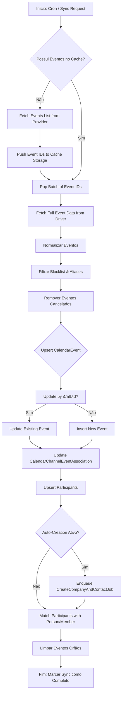

# Fluxograma: Sincronização de Calendário

Este diagrama descreve o processo de sincronização de eventos de calendário, desde o fetch no provedor externo até a persistência e criação de contatos.

```mermaid
graph TD
    A[Início: Cron / Sync Request] --> B{Possui Eventos no Cache?}
    B -- Não --> C[Fetch Events List from Provider]
    C --> D[Push Event IDs to Cache Storage]
    D --> E[Pop Batch of Event IDs]
    B -- Sim --> E
    
    E --> F[Fetch Full Event Data from Driver]
    F --> G[Normalizar Eventos]
    
    G --> H[Filtrar Blocklist & Aliases]
    H --> I[Remover Eventos Cancelados]
    
    I --> J{Upsert CalendarEvent}
    J --> K[Update by iCalUid?]
    K -- Sim --> L[Update Existing Event]
    K -- Não --> M[Insert New Event]
    
    L & M --> N[Update CalendarChannelEventAssociation]
    
    N --> O[Upsert Participants]
    O --> P{Auto-Creation Ativo?}
    P -- Sim --> Q[Enqueue CreateCompanyAndContactJob]
    P -- Não --> R[Match Participants with Person/Member]
    Q --> R
    
    R --> S[Limpar Eventos Órfãos]
    S --> T[Fim: Marcar Sync como Completo]
```
