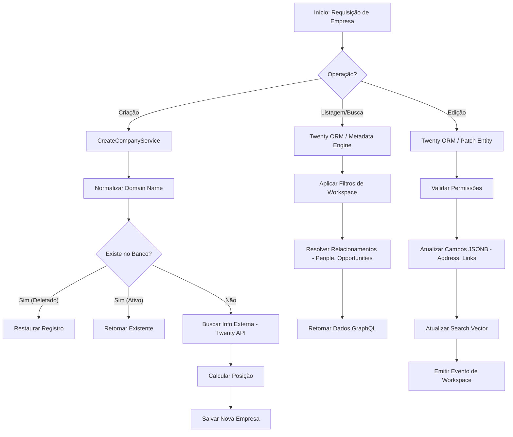

# Fluxograma: Módulo Company

```mermaid
graph TD
    A[Início: Requisição de Empresa] --> B{Operação?}
    B -- Criação --> C[CreateCompanyService]
    B -- Listagem/Busca --> D[Twenty ORM / Metadata Engine]
    B -- Edição --> E[Twenty ORM / Patch Entity]
    
    C --> C1[Normalizar Domain Name]
    C1 --> C2{Existe no Banco?}
    C2 -- Sim (Deletado) --> C3[Restaurar Registro]
    C2 -- Sim (Ativo) --> C4[Retornar Existente]
    C2 -- Não --> C5[Buscar Info Externa - Twenty API]
    C5 --> C6[Calcular Posição]
    C6 --> C7[Salvar Nova Empresa]
    
    D --> D1[Aplicar Filtros de Workspace]
    D1 --> D2[Resolver Relacionamentos - People, Opportunities]
    D2 --> D3[Retornar Dados GraphQL]
    
    E --> E1[Validar Permissões]
    E1 --> E2[Atualizar Campos JSONB - Address, Links]
    E2 --> E3[Atualizar Search Vector]
    E3 --> E4[Emitir Evento de Workspace]
```
