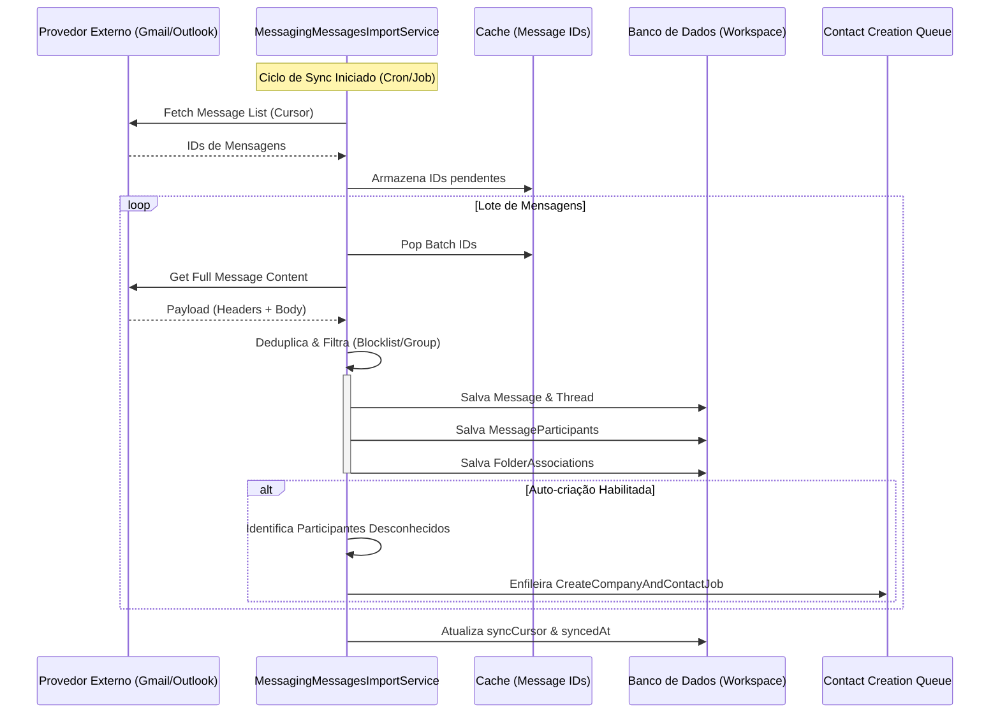
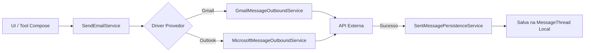

# Fluxo de Sincronização: Messaging

Este diagrama descreve o ciclo de vida da sincronização de e-mails e a criação automática de contatos.

```mermaid
sequenceDiagram
    participant P as Provedor Externo (Gmail/Outlook)
    participant S as MessagingMessagesImportService
    participant C as Cache (Message IDs)
    participant DB as Banco de Dados (Workspace)
    participant Q as Contact Creation Queue

    Note over S: Ciclo de Sync Iniciado (Cron/Job)
    
    S->>P: Fetch Message List (Cursor)
    P-->>S: IDs de Mensagens
    S->>C: Armazena IDs pendentes
    
    loop Lote de Mensagens
        S->>C: Pop Batch IDs
        S->>P: Get Full Message Content
        P-->>S: Payload (Headers + Body)
        
        S->>S: Deduplica & Filtra (Blocklist/Group)
        
        activate S
        S->>DB: Salva Message & Thread
        S->>DB: Salva MessageParticipants
        S->>DB: Salva FolderAssociations
        deactivate S
        
        alt Auto-criação Habilitada
            S->>S: Identifica Participantes Desconhecidos
            S->>Q: Enfileira CreateCompanyAndContactJob
        end
    end
    
    S->>DB: Atualiza syncCursor & syncedAt
```

## Orquestração de Outbound

```mermaid
graph LR
    A[UI / Tool Compose] --> B[SendEmailService]
    B --> C{Driver Provedor}
    C -- Gmail --> D[GmailMessageOutboundService]
    C -- Outlook --> E[MicrosoftMessageOutboundService]
    D --> F[API Externa]
    E --> F
    F -- Sucesso --> G[SentMessagePersistenceService]
    G --> H[Salva na MessageThread Local]
```
