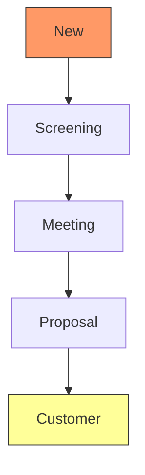
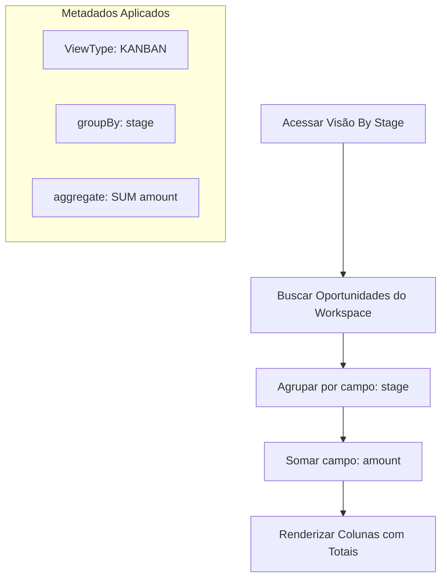

# Fluxogramas: Opportunity

## Fluxo de Funil (Pipeline)
Representação dos estágios sequenciais definidos nos metadados.

## Lógica de Agregação do Kanban
Processo de renderização da visão de Kanban com cálculo de totais.

