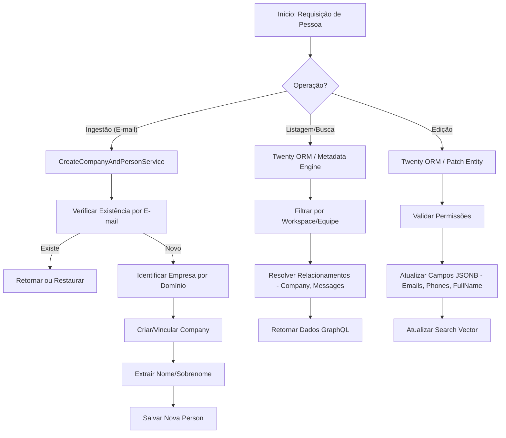

# Fluxograma: Módulo Person

```mermaid
graph TD
    A[Início: Requisição de Pessoa] --> B{Operação?}
    B -- Ingestão (E-mail) --> C[CreateCompanyAndPersonService]
    B -- Listagem/Busca --> D[Twenty ORM / Metadata Engine]
    B -- Edição --> E[Twenty ORM / Patch Entity]
    
    C --> C1[Verificar Existência por E-mail]
    C1 -- Existe --> C2[Retornar ou Restaurar]
    C1 -- Novo --> C3[Identificar Empresa por Domínio]
    C3 --> C4[Criar/Vincular Company]
    C4 --> C5[Extrair Nome/Sobrenome]
    C5 --> C6[Salvar Nova Person]
    
    D --> D1[Filtrar por Workspace/Equipe]
    D1 --> D2[Resolver Relacionamentos - Company, Messages]
    D2 --> D3[Retornar Dados GraphQL]
    
    E --> E1[Validar Permissões]
    E1 --> E2[Atualizar Campos JSONB - Emails, Phones, FullName]
    E2 --> E3[Atualizar Search Vector]
```
