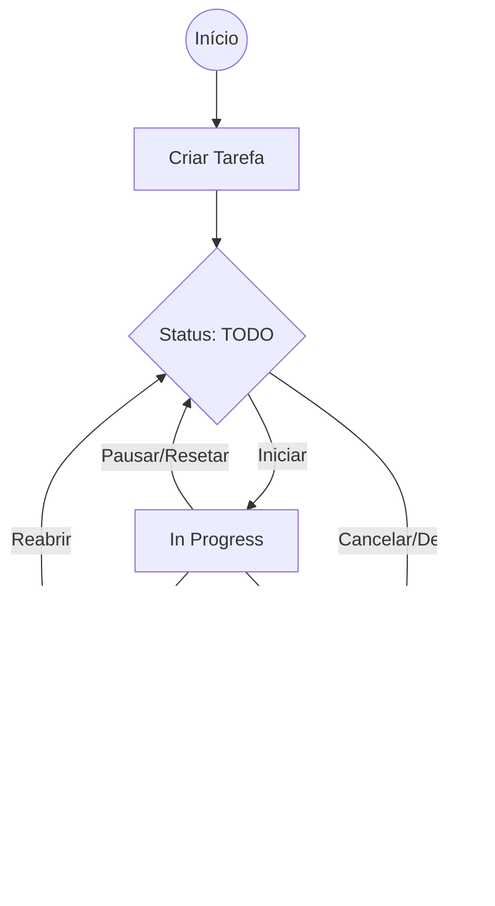
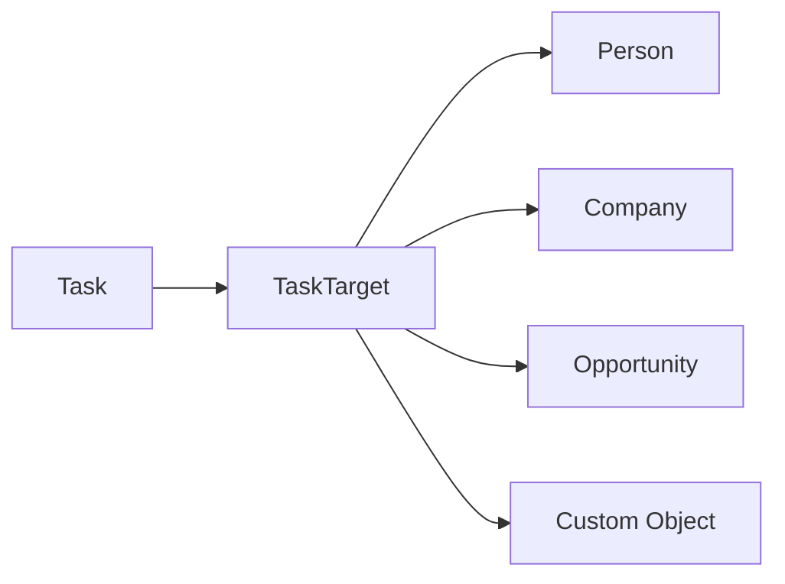

# Fluxograma: Módulo Task

## Ciclo de Vida da Tarefa

```mermaid
graph TD
    START((Início)) --> CREATE[Criar Tarefa]
    CREATE --> TODO{Status: TODO}
    
    TODO -->|Iniciar| IN_PROGRESS[In Progress]
    IN_PROGRESS -->|Pausar/Resetar| TODO
    IN_PROGRESS -->|Completar| DONE[Done]
    
    TODO -->|Cancelar/Deletar| DELETED((Deletado))
    IN_PROGRESS -->|Deletar| DELETED
    DONE -->|Reabrir| TODO
    DONE -->|Arquivar/Limpar| END((Fim))
```

## Relacionamento Polimórfico (TaskTarget)

```mermaid
graph LR
    TASK[Task] --> TARGETS[TaskTarget]
    TARGETS --> PERSON[Person]
    TARGETS --> COMPANY[Company]
    TARGETS --> OPPORTUNITY[Opportunity]
    TARGETS --> CUSTOM[Custom Object]
```
