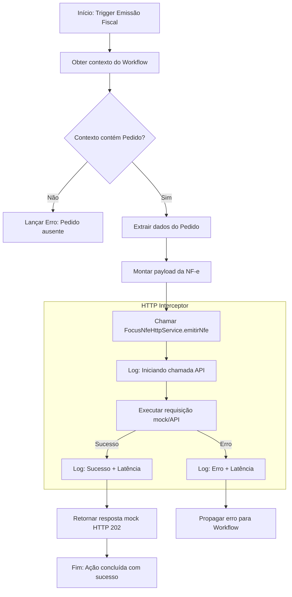

# Fluxos de Controle - Módulo: twenty-erp

> Documento gerado pelo Archaeologist do Reversa.

## Emissão Fiscal (Workflow Action)

Este fluxo representa a lógica executada pela `EmissorFiscalWorkflowAction` dentro do motor de workflow quando um evento de emissão fiscal é disparado.

