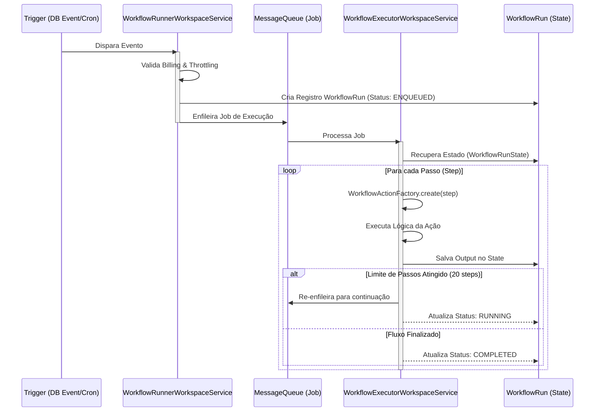
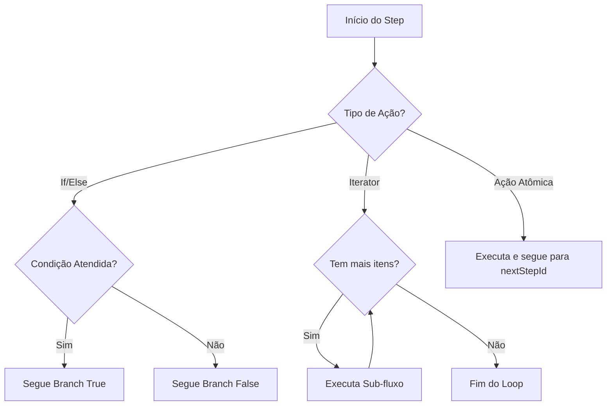

# Fluxo de Execução: Workflow Engine

Este diagrama descreve a orquestração entre o Runner (entrada/enfileiramento) e o Executor (motor de passos).

```mermaid
sequenceDiagram
    participant T as Trigger (DB Event/Cron)
    participant R as WorkflowRunnerWorkspaceService
    participant Q as MessageQueue (Job)
    participant E as WorkflowExecutorWorkspaceService
    participant DB as WorkflowRun (State)

    T->>R: Dispara Evento
    activate R
    R->>R: Valida Billing & Throttling
    R->>DB: Cria Registro WorkflowRun (Status: ENQUEUED)
    R->>Q: Enfileira Job de Execução
    deactivate R

    Q->>E: Processa Job
    activate E
    E->>DB: Recupera Estado (WorkflowRunState)
    
    loop Para cada Passo (Step)
        E->>E: WorkflowActionFactory.create(step)
        E->>E: Executa Lógica da Ação
        E->>DB: Salva Output no State
        
        alt Limite de Passos Atingido (20 steps)
            E->>Q: Re-enfileira para continuação
            E-->>DB: Atualiza Status: RUNNING
        else Fluxo Finalizado
            E-->>DB: Atualiza Status: COMPLETED
        end
    end
    deactivate E
```

## Pontos de Decisão (Branching)

```mermaid
graph TD
    A[Início do Step] --> B{Tipo de Ação?}
    B -- "If/Else" --> C{Condição Atendida?}
    C -- Sim --> D[Segue Branch True]
    C -- Não --> E[Segue Branch False]
    B -- "Iterator" --> F{Tem mais itens?}
    F -- Sim --> G[Executa Sub-fluxo]
    G --> F
    F -- Não --> H[Fim do Loop]
    B -- "Ação Atômica" --> I[Executa e segue para nextStepId]
```
