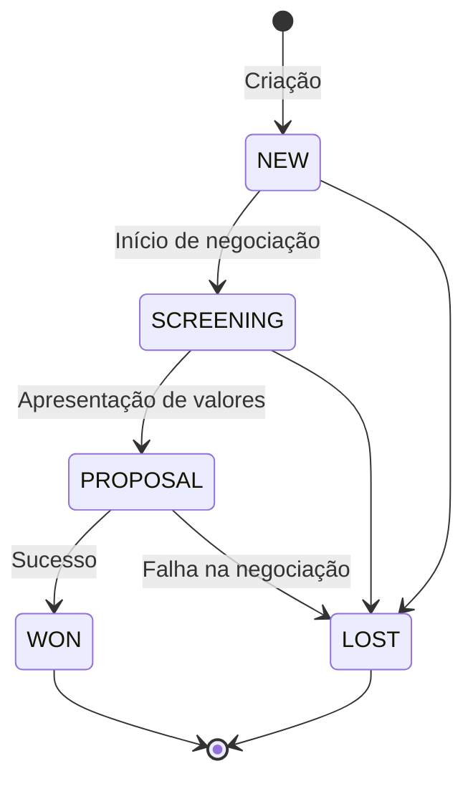
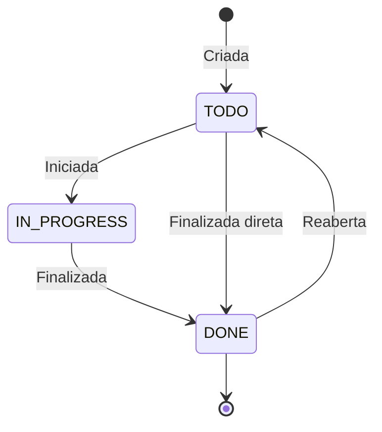
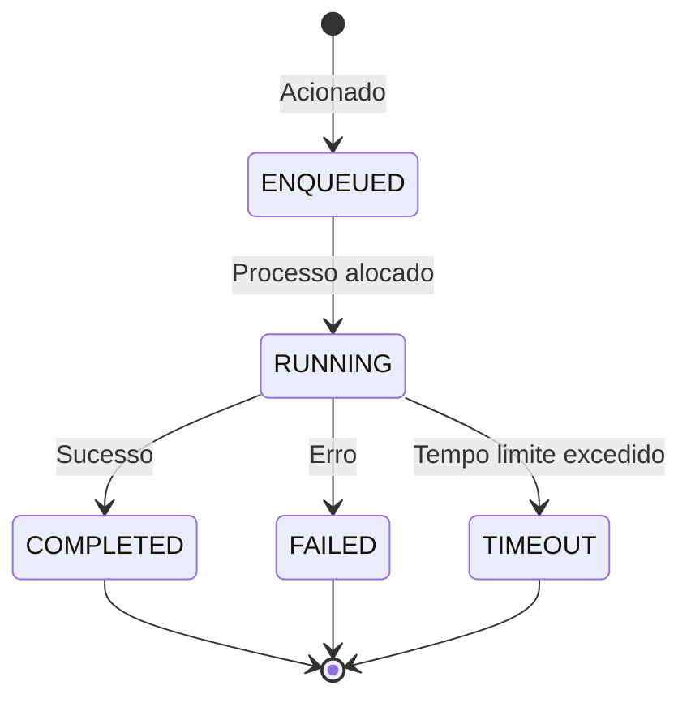
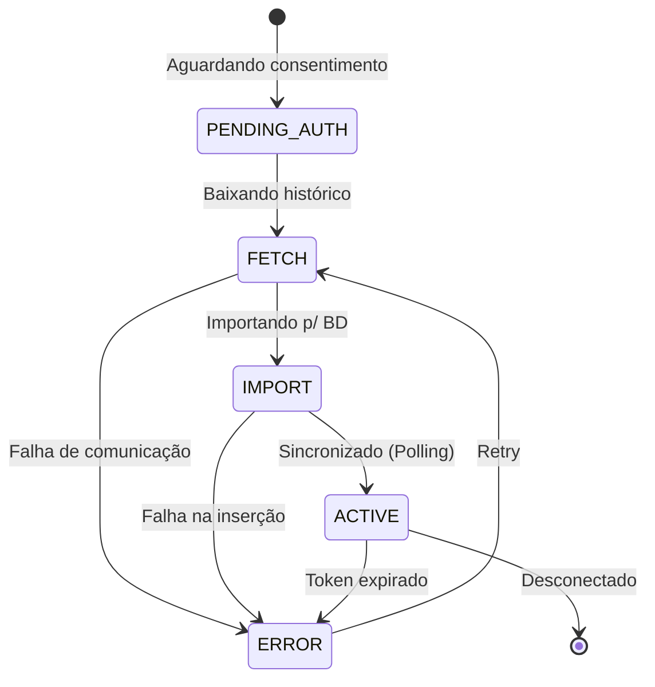

# Máquinas de Estado

Documentação das transições de estado para as principais entidades do CRM.

## Opportunity (Oportunidade)
A oportunidade transita por diversos estágios do funil. O campo `stage` define o estado.

> Confiança: 🟡 INFERIDO (Os estágios exatos podem ser customizáveis).

---

## Task (Tarefa)
O fluxo básico de conclusão de tarefas baseado no campo `status`.

> Confiança: 🟢 CONFIRMADO

---

## WorkflowRun (Execução de Fluxo)
O ciclo de vida de uma execução em background (`WorkflowRun`).

> Confiança: 🟡 INFERIDO

---

## Sync Channels (CalendarChannel / MessageChannel)
Representa o status da sincronização de e-mails ou calendários com provedores externos (`syncStage`).

> Confiança: 🟡 INFERIDO
